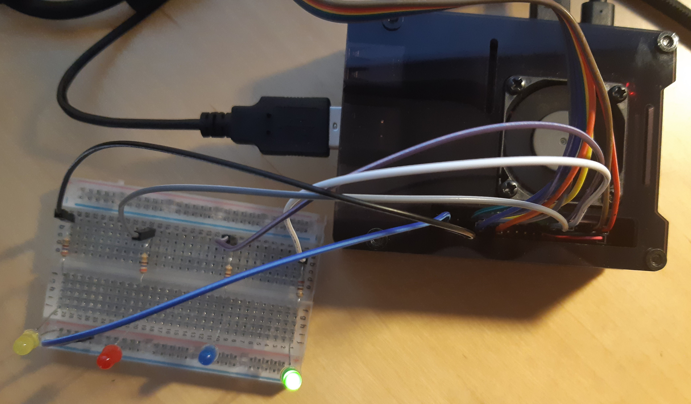
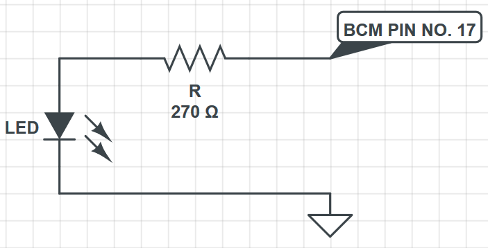

# blinky

Program to blink some LEDs connected to the RaspberryPi.

## Requirements 
- RaspberryPi with [wiringPi](http://wiringpi.com/) lib installed
- [Jumper wires (female-male)](img/jumper-wire-female-male.jpg)
- [Protoboard](img/protoboard.jpg)
- [270Ohm resistors](img/270OhmResistor.jpg)
- [LEDs](img/LEDs.jpg)

## Proposed wiring diagram
Following table is a proposal of how to connect the LEDs to the raspberryPi.

As in code I have used BCM pin codes, implementation should work in almost any rasberryPi model.

You can execute wiringPi's function `gpio readall` in your raspberryPi terminal to check where your GPIO board has the BCM pins used.

| BCM | Mode | Connection |
|:---:|:----:|:----------:|
| 17  |OUT   | GREEN_LED  |
| 27  |OUT   | BLUE_LED   |
| 22  |OUT   | RED_LED    |
| 21  |OUT   | YELLOW_LED |

For example, the connection of green LED is the following:

## Implementation
The program makes each LED blink sequentially in a loop.
When the program end all the LEDs are switched OFF.