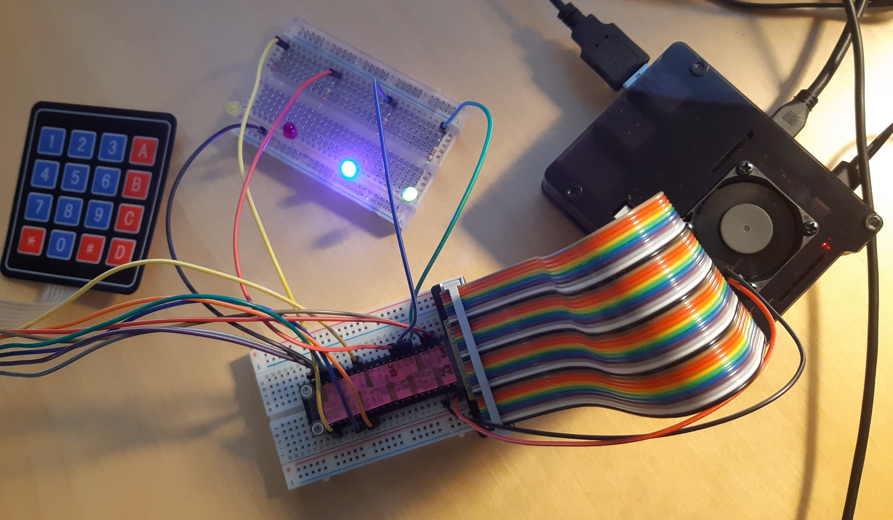

# remote-led

Program that uses a matrix keyboard to light some LEDs on demand.

## Requirements 
- RaspberryPi with [wiringPi](http://wiringpi.com/) lib installed
- [Jumper wires (female-male)](img/jumper-wire-female-male.jpg)
- [Protoboard](img/protoboard.jpg)
- [270Ohm resistors](img/270OhmResistor.jpg)
- [LEDs](img/LEDs.jpg)
- [Matrix keyboard](img/matrix-keyboard.jpg)

## Proposed wiring diagram
Following table is a proposal of how to connect the LEDs & the matrix keyboard to the raspberryPi.

As in code I have used BCM pin codes, implementation should work in almost any rasberryPi model.

You can execute wiringPi's function `gpio readall` in your raspberryPi terminal to check where your GPIO board has the BCM pins used.

| BCM | Mode | Connection |
|:---:|:----:|:----------:|
| 0   |OUT   | COL_1      |
| 1   |OUT   | COL_2      |
| 2   |OUT   | COL_3      |
| 3   |OUT   | COL_4      |
| 19  |IN    | ROW_1      |
| 26  |IN    | ROW_2      |
| 12  |IN    | ROW_3      |
| 13  |IN    | ROW_4      |
| 17  |OUT   | GREEN_LED  |
| 27  |OUT   | BLUE_LED   |
| 22  |OUT   | RED_LED    |
| 21  |OUT   | YELLOW_LED |

Although the matrix keyboard can be directly connected to GPIO pins, for the LEDS a resistor should be used. 

For example, the connection of green LED is the following:

## Implementation
It uses a nested loop to read the matrix keyboard and keystrokes are mapped to do some actions with the LEDs as follows:

| Key              | Action                                                    |
|:----------------:|:---------------------------------------------------------:|
| A                | Toggle GREEN_LED                                          |
| B                | Toggle BLUE_LED                                           |
| C                | Toggle RED_LED                                            |
| D                | Toggle YELLOW_LED                                         |
| 0                | Invert the LEDs ON/OFF status                             |
| Digit above zero | Sequentially blink that number of times LEDs that were on |
| *                | Switch OFF every LED                                      |
| #                | Switch ON every LED                                       |
